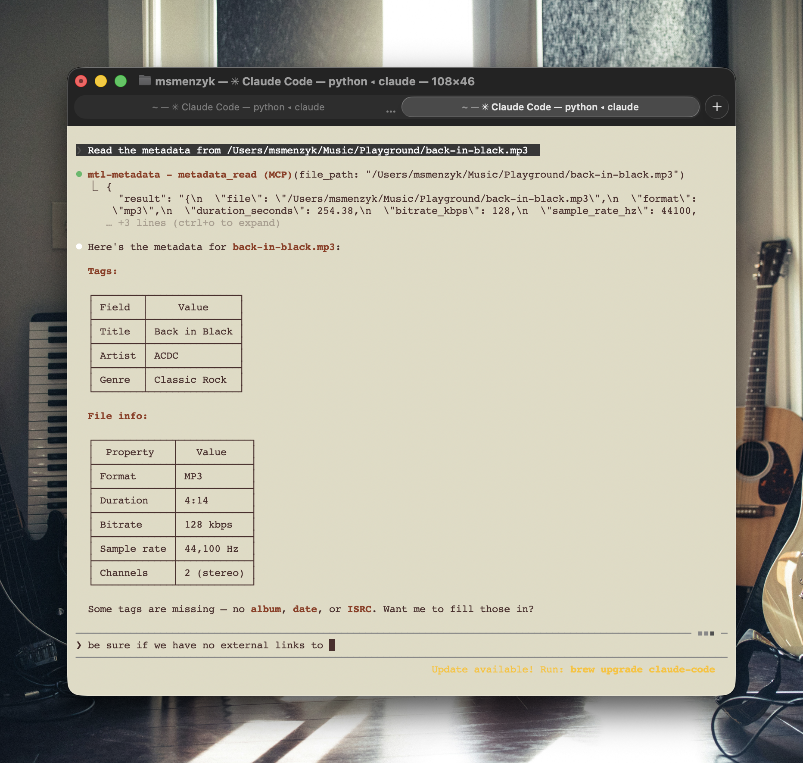

# mtl-metadata-mcp

[](LICENSE)
[](https://github.com/musictechlab/mtl-metadata-mcp/actions/workflows/ci.yml)

MCP server for reading and embedding metadata in audio files (MP3, FLAC, OGG). Built for [Claude Code](https://claude.com/claude-code).

> **⚠️ Experimental** — This project is in early development. Use at your own risk. We make no guarantees about stability or correctness and accept no responsibility for data loss or corrupted files. Always back up your audio files before modifying metadata.



## Tools

| Tool | Description |
|------|-------------|
| `metadata_read` | Read metadata tags and file info from an audio file |
| `metadata_write` | Embed metadata (title, artist, album, date, genre, ISRC) into an audio file |
| `metadata_clear` | Remove all metadata tags from an audio file |
| `metadata_scan` | Scan a directory for audio files and report metadata status |

## Supported fields

| Field | Description | Example |
|-------|-------------|---------|
| Title | Track name | "Back in Black" |
| Artist | Performer | "AC/DC" |
| Album | Album name | "Back in Black" |
| Date | Release year | "1980" |
| Genre | Music genre | "Classic Rock" |
| ISRC | International Standard Recording Code | "US-S1Z-99-00001" |

## Supported formats

- MP3 (ID3v2 tags)
- FLAC (Vorbis comments)
- OGG (Vorbis comments)

## Setup

```bash
git clone https://github.com/musictechlab/mtl-metadata-mcp.git
cd mtl-metadata-mcp
poetry install
```

## Claude Code configuration

```bash
claude mcp add -s user mtl-metadata -- bash -c "cd /path/to/mtl-metadata-mcp && poetry run python -m mtl_metadata_mcp"
```

## Usage examples

Once configured, just ask Claude Code in natural language:

### Reading metadata

> "What metadata does `track.mp3` have?"

```json
{
  "file": "/Users/you/Music/track.mp3",
  "format": "mp3",
  "duration_seconds": 234.56,
  "bitrate_kbps": 320,
  "sample_rate_hz": 44100,
  "channels": 2,
  "metadata": {
    "title": "Back in Black",
    "artist": "AC/DC",
    "genre": "Classic Rock"
  }
}
```

### Embedding metadata

> "Set the artist to AC/DC, album to Back in Black, date to 1980, and ISRC to USAB12345678 on `track.mp3`"

Only the fields you mention are updated — everything else stays untouched.

### Scanning a music library

> "Scan my `~/Music/demos` folder and tell me which tracks are missing metadata"

```json
{
  "directory": "/Users/you/Music/demos",
  "total_files": 3,
  "files": [
    {
      "file": "/Users/you/Music/demos/idea-01.mp3",
      "format": "mp3",
      "has_metadata": true,
      "fields_present": ["title", "artist"],
      "fields_missing": ["album", "date", "genre", "isrc"]
    },
    {
      "file": "/Users/you/Music/demos/sketch.flac",
      "format": "flac",
      "has_metadata": false,
      "fields_present": [],
      "fields_missing": ["title", "artist", "album", "date", "genre", "isrc"]
    }
  ]
}
```

### Clearing metadata

> "Strip all tags from `track.mp3`"

Removes all ID3/Vorbis tags. Audio data is preserved.

### Batch workflows

You can combine tools in conversation:

> "Scan `~/Music/album` for files missing ISRC codes, then set ISRC to USAB12300001 through USAB12300010 on each track in order"

## Tech stack

- Python 3.10+
- [mutagen](https://mutagen.readthedocs.io/) — audio metadata parsing and writing
- [MCP SDK](https://modelcontextprotocol.io/) — Model Context Protocol server framework
- [Poetry](https://python-poetry.org/) — dependency management

## Contributing

Contributions are welcome! Please read [CONTRIBUTING.md](CONTRIBUTING.md) before submitting a PR.

## Security

To report a vulnerability, please see [SECURITY.md](SECURITY.md).

## License

This project is licensed under the MIT License — see [LICENSE](LICENSE) for details.

---

<div align="center">
  MusicTech Lab - Rockstars Developers dedicated to the Music Industry<br>
  <a href="https://musictechlab.io">Website</a>
  <span> | </span>
  <a href="https://linkedin.com/company/musictechlab">LinkedIn</a>
  <span> | </span>
  <a href="mailto:hello@musictechlab.io">Let's talk</a><br>
  Crafted by <a href="https://musictechlab.io">musictechlab.io</a>
</div>
